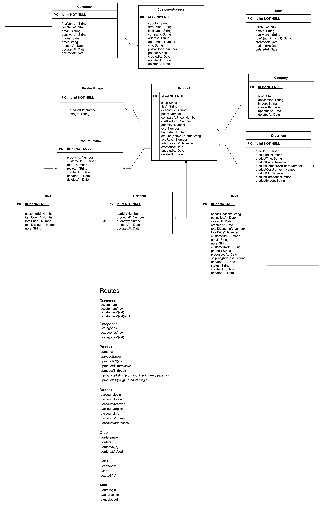

1. Ознайомитись з задачею.
2. Пошук референсів на дану задачу (ecommerce cms: shopify, wix, bigcommerce, woocommerce, squarespace; demo resources: shopify free trial etc.)
3. На прикладі shopify адмінки записуємо поля, які будуть потрібні:

### Customer

- id
- firstName\*
- lastName\*
- email\*
- password\*
- phone
- note
- createdAt
- updatedAt
- deletedAt

### CustomerAddress

- id
- country
- firstName
- lastName
- company
- address
- apartment
- city
- postalCode
- phone
- createdAt
- updatedAt
- deletedAt

4. Створюємо в shopify admin panel тестового customer-а
5. Базуючись на роутах shopify admin panel беремо роути

## Routes

### Customers

- /admin/customers/new
- /admin/customers
- /admin/customers/${id}
- /admin/customers/${id}/edit

6. Переходимо в Products/Collections і беремо звідти потрібні поля згідно з задачею

### Category

- id
- title\*
- description
- image
- createdAt
- updatedAt
- deletedAt

7. Створюємо тестову Collection і беремо потрібні роути

## Routes

### Category

- /admin/categories/new
- /admin/categories
- /admin/categories/${id}
- /admincreatedAt
- /admin/updatedAt
- /admin/deletedAt

8. Створюємо тестовий продукт і беремо потрібні поля

### Product

- id
- slug
- title\*
- description
- price
- compareAtPrice
- costPerItem
- quantity
- sku
- barcode
- status\* (active | draft)
- avgRate\*
- totalReviews\*
- createdAt
- updatedAt
- deletedAt

### ProductImages

- id
- productId\*
- image\*

### Routes

## Product

- /products/new
- /products
- /products/${id}
- product/${id}/reviews
- product/${id}/edit

9. Export products -> email
   Export products - це фонова задача, результат віправляється на емейл власника стору.
   Оскільки є бекграунд задача, треба спланувати як її реалізувати.

# Questions

1. Product "costPerItem"?
2. Background tasks?
3. Export/Import result?
4. One or two projects?

5. Переходимо в Store.

### Store

## Routes

### Products

/ - products listing (sort and filter in query params)
/products/${slug} - product single

11. В settings додаємо авторизацію для customer: Settings -> Customer Accounts -> Show login links -> Classic

### Store

## Routes

### Account

/account/login
/account/logout
/account/recover
/account/register
/account/info - main info
/accounts/orders - orders
/account/addresses - addresses

### Cart

/cart

### Cart

- id
- customerId
- itemCount\*
- totalPrice\*
- totalDiscount\*
- note

### CartItem

- id
- cartId\*
- productId\*
- quantity\*
- createdAt\*
- updatedAt

12. Order -> take from shopify api

### Order

- id
- cancelReason
- cancelledAt
- closedAt
- createdAt
- totalDiscounts\*
- totalPrice\*
- customerId
- email
- note
- customerNote
- phone\*
- processedAt
- shippingAddress\*
- updatedAt\*
- status (?)
- createdAt\*
- updatedAt

### OrderItem

- id
- orderId
- productId
- productTitle
- productPrice
- productCompareAtPrice
- productCostPerItem
- productSku
- productBarcode
- productImage

### Routes

## Order

- /orders/new
- /orders
- /orders/${id}
- /orders/${id}/edit

## Carts

- /admin/carts/new
- /admin/carts
- /admin/carts/${id}

13. Заходимо на приклади магазинів, наприклад rozetka.com.ua, дивимось на реалізацію відгуків і рейтингів.

### ProductReview

- id
- productId
- customerId
- rate\*
- review\*
- createdAt\*
- updatedAt
- deletedAt

14. User

### User

- id
- fullName\*
- email\*
- password\*
- role\* (admin | stuff)
- createdAt
- updatedAt
- deletedAt

## Routes

### Auth

- /admin/auth/login
- /admin/auth/recover
- /admin/auth/logout

### Users

- /admin/users/new
- /admin/users
- /admin/users/${id}

UML Diagram:

